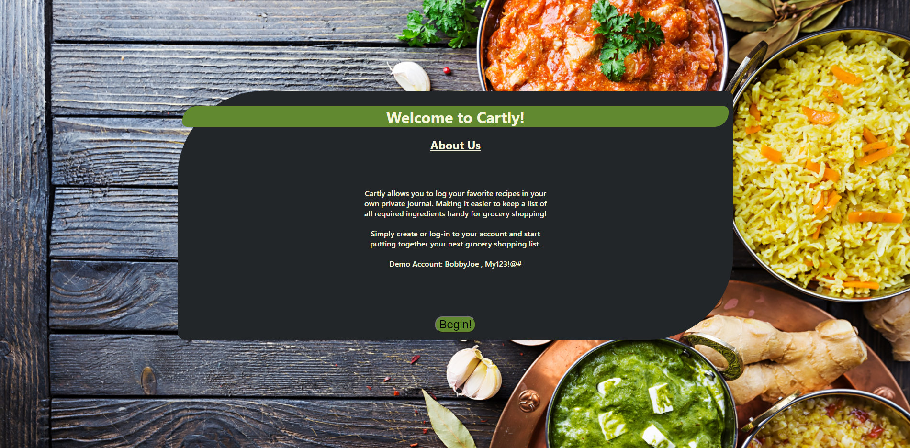
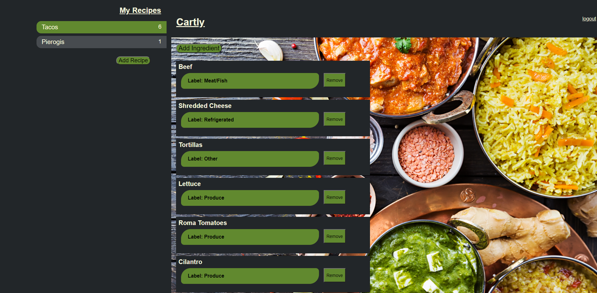
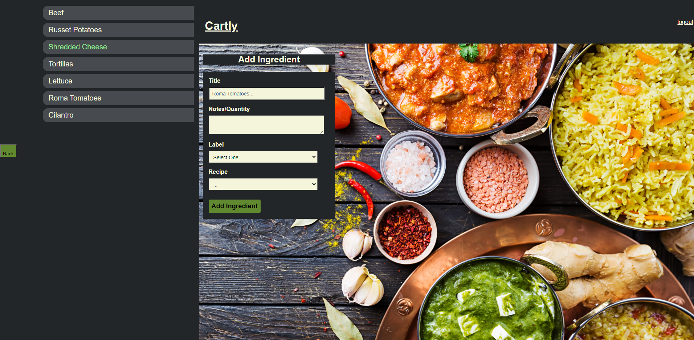

# Cartly - Client

## Built By
Jared Angel Escobedo

## Links
Live site: https://cart-client.vercel.app  
Server: https://cartly-001.herokuapp.com   
Client Repo: https://github.com/JaredAngel/cartly-client  
Server Repo: https://github.com/JaredAngel/cartly-server

### Summary
Cartly allows you to log your favorite recipes in your own private journal. 
Making it easier to keep a list of all required ingredients handy for grocery shopping!

## Screenshots

### User Stories
Role: New User
Task: Signup for new account
Importance: High

Role: Returning User
Task: Login to my account
Importance: High

Role: New User
Task: Log new entries to account
Importance: Medium

Role: Returning User
Task: View entries on account
Importance: Medium

Role: Administrator
Task: View all user accounts
Importance: High

Role: Administrator
Task: View usage reports
Importance: Low

........

### Component Tree
- **Index.js**
  - **LandingPage** (stateful)
    - **RegistrationRoute**
      - **RegistrationForm** (stateful)
    - **LoginRoute**
      - **LoginForm** (stateful)
  - **App.js** (stateful)
    - **IngredientListMain**
    - **IngredientPageMain**
    - **AddRecipe**
      - **RecipeForm** (stateful)
    - **AddIngredient**
      - **RecipeForm** (stateful)
    - **IngredientPageNav**
    - **IngredientListNav**
  
## Technologies
- Front End
  * HTML
  * CSS
  * JavaScript
  * React
- Back End
  * Node.js
  * Express
  * Postgres

This project was bootstrapped with [Create React App](https://github.com/facebook/create-react-app).

## Available Scripts

In the project directory, you can run:

### `npm start`

Runs the app in the development mode. 
Open [http://localhost:3000](http://localhost:3000) to view it in the browser.

The page will reload if you make edits. 
You will also see any lint errors in the console.

### `npm test`

Launches the test runner in the interactive watch mode. 
See the section about [running tests](https://facebook.github.io/create-react-app/docs/running-tests) for more information.

### `npm run build`

Builds the app for production to the `build` folder. 
It correctly bundles React in production mode and optimizes the build for the best performance.

The build is minified and the filenames include the hashes. 
Your app is ready to be deployed!

See the section about [deployment](https://facebook.github.io/create-react-app/docs/deployment) for more information.

### `npm run eject`

**Note: this is a one-way operation. Once you `eject`, you can’t go back!**

If you aren’t satisfied with the build tool and configuration choices, you can `eject` at any time. This command will remove the single build dependency from your project.

Instead, it will copy all the configuration files and the transitive dependencies (webpack, Babel, ESLint, etc) right into your project so you have full control over them. All of the commands except `eject` will still work, but they will point to the copied scripts so you can tweak them. At this point you’re on your own.

You don’t have to ever use `eject`. The curated feature set is suitable for small and middle deployments, and you shouldn’t feel obligated to use this feature. However we understand that this tool wouldn’t be useful if you couldn’t customize it when you are ready for it.